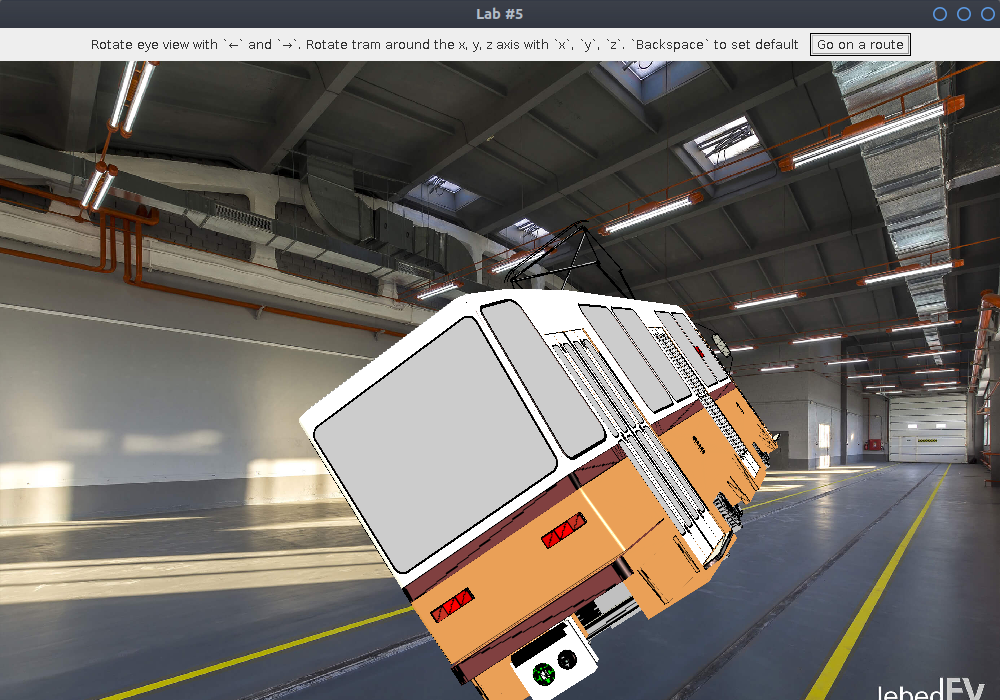
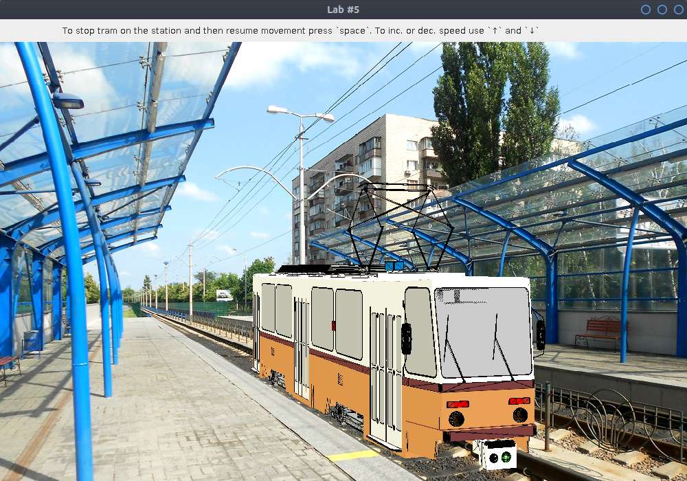

# Лаброторна робота №5

## Варіант 5 - непарний номер
### Тому було імпортовано модель трамваю формату .obj
Для цього було скачано модель формату .fbx та конвертано в .obj
за допомгою програми Blender, там же було згенеровано зображення
текстури відповідно до записаної в .obj файл UV карти

#### Анімація

[animation in .webm](img/animation.webm)

#### Скріншоти 

