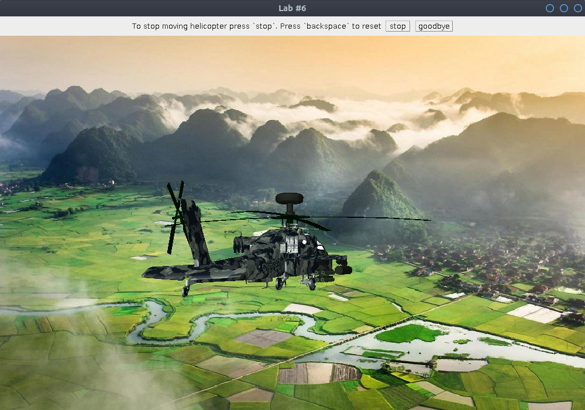

# Лаброторна робота №6

## Варіант 5 
Анімація вертольоту helicopter.obj. У вертольота повинні рухатися обидва
гвинти, вертоліт повинен пересуватися по екрану.

#### Анімація

[animation in .webm](img/animation.webm)

#### Скріншоти 

